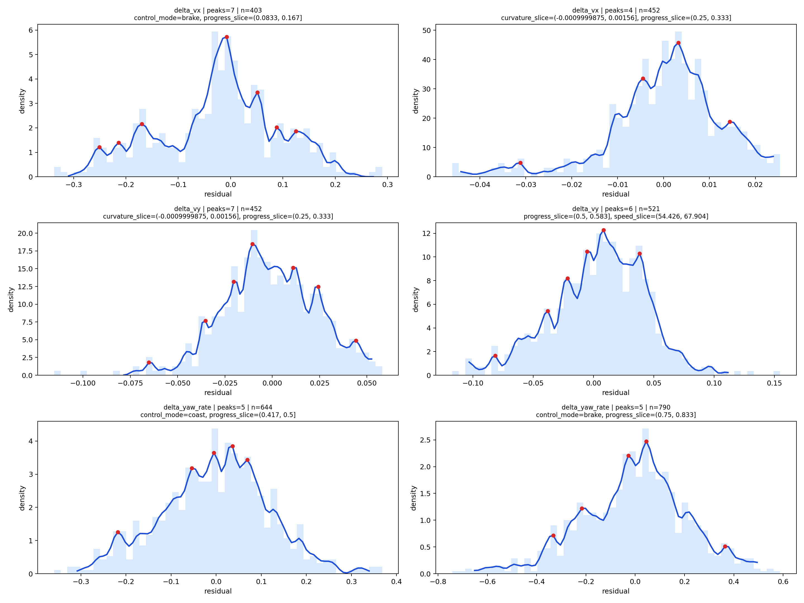
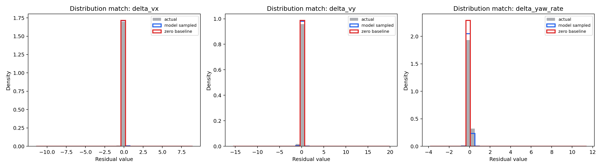
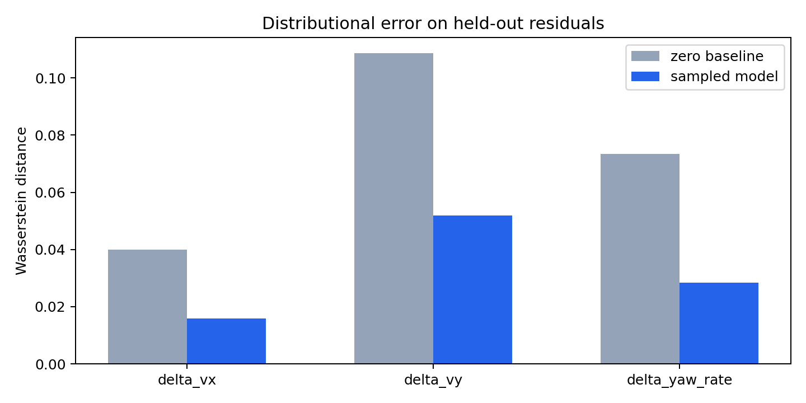

# uncertain-racecar-gym

`uncertain-racecar-gym` is a racing-focused Gymnasium environment for studying the gap between:

- a clean nominal dynamic-bicycle model,
- simple Gaussian disturbance models,
- and data-driven empirical uncertainty learned from offline [Assetto Corsa](https://github.com/dasGringuen/assetto_corsa_gym?tab=readme-ov-file#train-sac-from-demonstrations-using-an-ensemble-of-buffers) laps.

The repo is set up so you can:

- train a controller on the nominal model,
- evaluate the same controller under nominal / Gaussian / empirical uncertainty,
- render 3D diagnostic videos,
- and benchmark multiple controllers on the same stress-test suite.

Right now the repository already includes:

- a standard Gymnasium API,
- a JAX nominal environment for fast rollout and RL training,
- a telemetry-conditioned empirical residual model,
- a Tier 1 PyBullet renderer,
- a JAX PPO baseline,
- a JAX [MPPI](https://arxiv.org/abs/1707.02342) baseline,
- a JAX [Smooth MPPI](https://arxiv.org/abs/2112.09988) baseline,
- and a controller benchmark harness.

For the long technical explanation of the uncertainty pipeline, see [UNCERTAINTY_TECHNICAL_README.md](UNCERTAINTY_TECHNICAL_README.md).

## What the simulator does

At its core, the environment rolls out a nominal dynamic bicycle model with action:

- `steer_cmd`
- `throttle_cmd`
- `brake_cmd`

The observable racing state stays compact and controller-friendly:

- `progress`
- `lateral_error`
- `heading_error`
- `vx`
- `vy`
- `yaw_rate`
- current / lookahead curvature
- recent action history

Internally, the simulator can optionally inject uncertainty into the next-step dynamics. This is useful when a controller was designed on the clean nominal model but must be tested against realistic mismatch at evaluation time.

## Install with `uv`

Python `>=3.11` is required.

Minimal install:

```bash
uv sync --extra dev
uv run pytest -q
```

Full install for JAX training, PPO, and JAX MPC:

```bash
uv sync --extra dev --extra jax --extra rl
uv run --extra dev --extra jax --extra rl pytest -q
```

## Quick start

Basic Gym usage:

```python
import gymnasium as gym
import uncertain_racecar_gym  # registers UncertainRacecar-v0

env = gym.make(
    "UncertainRacecar-v0",
    scenario="package://scenarios/ks_barcelona_layout_gp_dallara_f317_rl_long.yaml",
    uncertainty=None,
)

obs, info = env.reset(seed=0)
obs, reward, terminated, truncated, info = env.step([0.0, 0.2, 0.0])
```

Switch uncertainty modes either in the constructor, at reset, or through `env.unwrapped.set_uncertainty(...)`.

Example:

```python
# pure nominal rollout
env.unwrapped.set_uncertainty(None)

# fixed Gaussian disturbance
env.unwrapped.set_uncertainty(
    "gaussian",
    gaussian_noise_std=[0.12, 0.08, 0.05, 0.015],
)

# empirical residual disturbance
env.unwrapped.set_uncertainty(
    "empirical",
    uncertainty_artifact="path/to/analysis_uncertainty.pkl",
    calibration_artifact="path/to/nominal_calibration.pkl",
)
```

## Uncertainty modes

There are three intended rollout modes:

- `uncertainty=None` or `"nominal"`
  - pure dynamic-bicycle rollout
- `uncertainty="gaussian"`
  - zero-mean fixed-variance perturbation on modeled next-step dynamics
- `uncertainty="empirical"`
  - data-driven residual sampling conditioned on state, action, track location, and telemetry context

### What gets injected in Gaussian mode

Gaussian mode perturbs the modeled dynamic channels:

- `delta_vx`
- `delta_vy`
- `delta_yaw_rate`
- `delta_steer`

with zero-mean, fixed user-provided standard deviations.

### What gets injected in empirical mode

Empirical mode does **not** inject a single Gaussian.

It does:

1. run the nominal bicycle model one step forward,
2. optionally apply a deterministic mean correction learned from real data,
3. sample a residual from a continuous empirical model,
4. add that residual to the next-step dynamics.

The empirical residual output channels are:

- `delta_vx`
- `delta_vy`
- `delta_yaw_rate`

The empirical model conditions on:

- track location and curvature,
- vehicle state,
- action,
- recent action history,
- and internal telemetry context such as acceleration, rear slip, drive-train speed, RPM, and gear.

Those telemetry channels are used to model uncertainty, but they are **not** exposed as policy observation.

### What kind of empirical noise this is

The current empirical model is:

- non-Gaussian,
- multimodal,
- regime-conditioned,
- and temporally correlated.

It is built from real Assetto offline laps rather than hand-picked random noise.

Barcelona examples from the current tracked analysis:



This plot shows real state-conditioned residual slices with multiple peaks, which is exactly the kind of structure that a single Gaussian would miss.



This plot shows that the empirical sampler follows the held-out residual distributions much more closely than a simple unimodal approximation.



This plot summarizes the held-out distribution matching improvement after calibration plus stochastic sampling.

For more detail, including the exact model structure and replay evaluation, see [UNCERTAINTY_TECHNICAL_README.md](UNCERTAINTY_TECHNICAL_README.md).

## Running the main code paths

### 1. Record a nominal / Gaussian / empirical rollout

```bash
uv run uncertain-racecar-record-rollout \
  --output-dir output \
  --name nominal_rollout \
  --steps 140 \
  --render-mode rgb_array_follow \
  --uncertainty-mode none

uv run uncertain-racecar-record-rollout \
  --output-dir output \
  --name gaussian_rollout \
  --steps 140 \
  --render-mode rgb_array_follow \
  --uncertainty-mode gaussian \
  --gaussian-std 0.12 0.08 0.05 0.015

uv run uncertain-racecar-record-rollout \
  --output-dir output \
  --name empirical_rollout \
  --steps 140 \
  --render-mode rgb_array_follow \
  --uncertainty-mode empirical \
  --uncertainty-artifact PATH_TO_ANALYSIS_UNCERTAINTY_PKL \
  --calibration-artifact PATH_TO_NOMINAL_CALIBRATION_PKL
```

### 2. Export a replay bundle

```bash
uv run uncertain-racecar-export-replay \
  --rollout-json output/empirical_rollout.json \
  --output-dir output/empirical_replay_bundle \
  --video-path output/empirical_rollout.mp4
```

### 3. Render a Tier 2 Blender clip

If Blender is installed locally, you can render the replay bundle into a higher-quality offline clip:

```bash
uv run uncertain-racecar-render-blender \
  --bundle-dir output/empirical_replay_bundle \
  --output-path output/empirical_blender_preview.mp4 \
  --engine BLENDER_EEVEE \
  --samples 64 \
  --resolution-x 960 \
  --resolution-y 544 \
  --frame-limit 120 \
  --save-blend-path output/empirical_blender_preview.blend
```

For a slower but higher-quality path, switch `--engine CYCLES`.

### 4. JAX nominal environment

The nominal JAX environment is in [jax_env.py](uncertain_racecar_gym/jax_env.py).

Example:

```python
import jax
import jax.numpy as jnp

from uncertain_racecar_gym.jax_env import NominalJaxRacecarEnv

env = NominalJaxRacecarEnv("package://scenarios/ks_barcelona_layout_gp_dallara_f317_rl_long.yaml")
key = jax.random.PRNGKey(0)

reset_out = env.reset(key, start_mode="random")
state = reset_out.state
obs = reset_out.observation

action = jnp.array([0.0, 0.2, 0.0], dtype=jnp.float32)
step_out = env.step_jit(state, action)
```

## Controllers and algorithms

The current built-in baselines are:

- JAX PPO
- JAX MPPI
- JAX Smooth MPPI

All three are intended to use **nominal planning/training information only**. Noise is injected only by the actual environment at evaluation time.

### PPO baseline

Train a nominal PPO policy and log to wandb:

```bash
uv run --extra jax --extra rl uncertain-racecar-train-ppo \
  --scenario package://scenarios/ks_barcelona_layout_gp_dallara_f317_rl_long.yaml \
  --output-dir output \
  --run-name ppo_barcelona_nominal_long \
  --total-timesteps 131072 \
  --num-envs 32 \
  --num-steps 128 \
  --num-minibatches 8 \
  --update-epochs 4 \
  --eval-interval-updates 4 \
  --eval-episodes 4 \
  --start-mode grid \
  --bc-epochs 0 \
  --wandb-project uncertain-racecar-gym-rl
```

Evaluate a saved PPO checkpoint:

```bash
uv run --extra jax --extra rl uncertain-racecar-evaluate-ppo \
  --checkpoint output/ppo_barcelona_nominal_long/ppo_nominal_policy.pkl \
  --scenario package://scenarios/ks_barcelona_layout_gp_dallara_f317_rl_long.yaml \
  --output-dir output/ppo_barcelona_nominal_long_eval \
  --mode all \
  --render-steps 2000 \
  --gaussian-std 0.7 0.45 0.30 0.08 \
  --empirical-artifact PATH_TO_ANALYSIS_UNCERTAINTY_PKL \
  --calibration-artifact PATH_TO_NOMINAL_CALIBRATION_PKL \
  --wandb-project uncertain-racecar-gym-rl
```

### MPPI baseline

```bash
uv run --extra jax uncertain-racecar-benchmark \
  --suite package://benchmarks/barcelona_nominal_controller_suite.yaml \
  --controller-kind mppi_jax \
  --controller-kwargs-json '{"horizon": 28, "num_samples": 384, "optimization_steps": 2, "replan_interval": 2, "driver_dataset": "output/barcelona_real/barcelona_real_canonical.parquet", "target_speed": 20.0, "min_speed": 9.0, "speed_profile_scale": 0.82, "speed_profile_quantile": 0.72, "lateral_weight": 24.0, "heading_weight": 14.0}' \
  --uncertainty-artifact PATH_TO_ANALYSIS_UNCERTAINTY_PKL \
  --calibration-artifact PATH_TO_NOMINAL_CALIBRATION_PKL \
  --output-dir output/mppi_barcelona_suite
```

### Smooth MPPI baseline

```bash
uv run --extra jax uncertain-racecar-benchmark \
  --suite package://benchmarks/barcelona_nominal_controller_suite.yaml \
  --controller-kind smooth_mppi_jax \
  --controller-kwargs-json '{"horizon": 28, "num_samples": 384, "optimization_steps": 2, "replan_interval": 2, "driver_dataset": "output/barcelona_real/barcelona_real_canonical.parquet", "target_speed": 20.0, "min_speed": 9.0, "speed_profile_scale": 0.82, "speed_profile_quantile": 0.72, "lateral_weight": 24.0, "heading_weight": 14.0, "action_diff_weight": 0.9, "delta_noise_std": [0.10, 0.08, 0.05], "delta_action_bounds": [0.26, 0.18, 0.14]}' \
  --uncertainty-artifact PATH_TO_ANALYSIS_UNCERTAINTY_PKL \
  --calibration-artifact PATH_TO_NOMINAL_CALIBRATION_PKL \
  --output-dir output/smooth_mppi_barcelona_suite
```

## Benchmarking controllers

The benchmark harness lets you compare controllers on the same suite under:

- nominal
- Gaussian
- empirical

Tracked suites:

- `package://benchmarks/barcelona_nominal_controller_suite.yaml`
- `package://benchmarks/monza_nominal_controller_suite.yaml`

Run the PPO baseline on the Barcelona suite:

```bash
uv run --extra jax --extra rl uncertain-racecar-benchmark \
  --suite package://benchmarks/barcelona_nominal_controller_suite.yaml \
  --controller-kind ppo_checkpoint \
  --checkpoint output/ppo_barcelona_nominal_long/ppo_nominal_policy.pkl \
  --uncertainty-artifact PATH_TO_ANALYSIS_UNCERTAINTY_PKL \
  --calibration-artifact PATH_TO_NOMINAL_CALIBRATION_PKL \
  --output-dir output/controller_benchmark_barcelona \
  --write-suite output/controller_benchmark_barcelona/resolved_suite.yaml \
  --package-dir output/controller_benchmark_barcelona/baseline_package
```

The benchmark outputs include:

- `benchmark_summary.md`
- `aggregate_metrics.csv`
- `episode_metrics.csv`
- `plots/benchmark_dashboard.png`

Important test-time metrics include:

- `mean_progress_delta`
- `mean_traveled_distance_m`
- `offtrack_rate`
- `mean_failure_step`
- `mean_max_abs_lateral_error`
- `mean_min_safety_margin`

The traveled-distance metric is useful because it separates:

- a controller that fails early after driving fast,
- from a controller that fails early while never building pace.

## Data and uncertainty workflow

### Synthetic demo workflow

Build a synthetic canonical dataset:

```bash
uv run uncertain-racecar-build-dataset \
  --output output/demo_dataset.parquet \
  --demo-episodes 2 \
  --steps-per-episode 50
```

Fit the uncertainty artifact:

```bash
uv run uncertain-racecar-fit-uncertainty \
  --input output/demo_dataset.parquet \
  --output output/demo_uncertainty.pkl
```

Analyze the uncertainty model:

```bash
uv run uncertain-racecar-analyze-uncertainty --output-dir output
```

### Real Assetto offline workflow

The intended order is:

1. reconstruct a track centerline from laps,
2. write a matching scenario YAML,
3. canonicalize the offline laps,
4. calibrate the nominal model,
5. fit the empirical uncertainty artifact,
6. benchmark controllers.

Example:

```bash
uv run uncertain-racecar-build-track \
  --output output/barcelona_real/ks_barcelona_layout_gp_centerline.csv \
  --scenario-output output/barcelona_real/ks_barcelona_layout_gp_dallara_f317.yaml \
  --report-dir output/barcelona_real/track_report \
  --scenario-name ks_barcelona_layout_gp_dallara_f317 \
  data/AssettoCorsaGymDataSet/data_sets/ks_barcelona-layout_gp/dallara_f317/*/laps/*.pkl

uv run uncertain-racecar-build-dataset \
  --scenario output/barcelona_real/ks_barcelona_layout_gp_dallara_f317.yaml \
  --output output/barcelona_real/barcelona_real_canonical.parquet \
  data/AssettoCorsaGymDataSet/data_sets/ks_barcelona-layout_gp/dallara_f317/*/laps/*.pkl

uv run uncertain-racecar-analyze-uncertainty \
  --scenario output/barcelona_real/ks_barcelona_layout_gp_dallara_f317.yaml \
  --output-dir output/barcelona_real/report \
  --dataset output/barcelona_real/barcelona_real_canonical.parquet \
  --source-description "Real Assetto Corsa Barcelona / dallara_f317 subset"
```

The dataset builder accepts:

- telemetry pickles with `telemetry` and `static_info`
- converted state pickles with `states` and `static_info`
- already-built canonical parquet files

## Rendering status

The current saved MP4s are **Pybullet diagnostic renders**, not the final publication renderer.

- Current
  - real-time PyBullet mirror rendering
  - useful for debugging, controller comparison, and saved MP4s
- WIP
  - replay export plus Blender rendering for later offline cinematic rendering
  - the repo now includes a headless Blender CLI: `uncertain-racecar-render-blender`
  - intended path for publication-quality videos

## Project layout

- `uncertain_racecar_gym/`
  - package code, controllers, JAX env, renderer, assets, and CLIs
- `tests/`
  - focused repo tests
- `docs/uncertainty_assets/`
  - tracked plots used by the documentation
- `output/`
  - ignored local artifacts for videos, logs, datasets, replay bundles, and benchmark results

## Useful follow-up docs

- [UNCERTAINTY_TECHNICAL_README.md](UNCERTAINTY_TECHNICAL_README.md)
