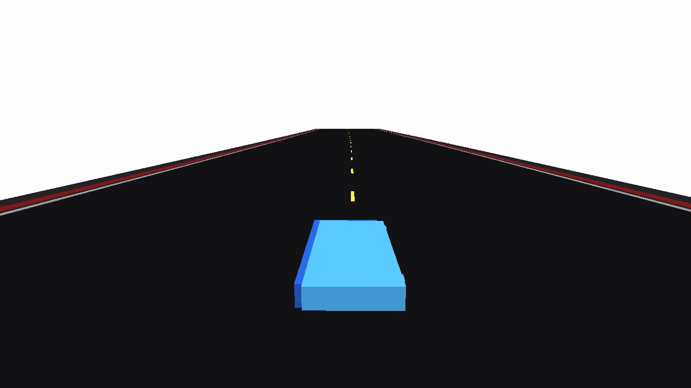
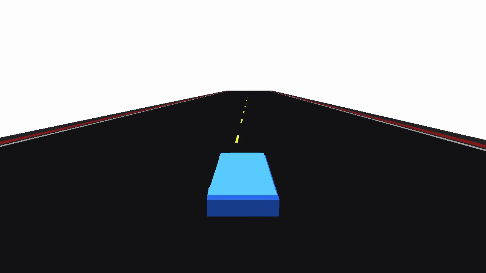

# Uncertainty Technical README

This document is the pushable summary of the current uncertainty system.

It focuses on:

1. where the uncertainty comes from,
2. how it is modeled and injected into the rollout,
3. what the latest real-data results say,
4. what is already working well and what still remains weak.

Read this together with:

- [README.md](README.md)
- [uncertain_racecar_gym/dataset.py](uncertain_racecar_gym/dataset.py)
- [uncertain_racecar_gym/deterministic.py](uncertain_racecar_gym/deterministic.py)
- [uncertain_racecar_gym/uncertainty.py](uncertain_racecar_gym/uncertainty.py)
- [uncertain_racecar_gym/env.py](uncertain_racecar_gym/env.py)
- [uncertain_racecar_gym/rendering.py](uncertain_racecar_gym/rendering.py)

## 1. Current status

The repo now has a real-data empirical uncertainty pipeline, not only a synthetic demo path.

The current uncertainty stack is:

- canonicalize offline Assetto laps into a shared schema,
- run a nominal dynamic bicycle model one step forward,
- compute one-step residuals,
- apply a hybrid deterministic calibration first,
- fit a stochastic empirical residual sampler on the centered leftovers,
- inject those residuals during Gymnasium rollouts.

The latest real-data runs summarized here come from:

- Barcelona `dallara_f317`
- Monza `dallara_f317`

## 2. What the uncertainty source is

### 2.1 Synthetic path

The synthetic path still exists for regression testing.

It is generated locally in [uncertain_racecar_gym/dataset.py](uncertain_racecar_gym/dataset.py) by rolling out the nominal model and injecting structured residuals on purpose.

That path is useful for:

- tests,
- debugging report generation,
- controlled pipeline regression checks.

### 2.2 Real Assetto path

The main uncertainty path is now based on offline Assetto laps.

Important point:

- this machine is **not** running live Assetto runtime,
- the uncertainty is coming from imported trajectory data,
- the simulator learns empirical residual structure from those imported laps.

The canonical ingestion path currently supports:

- telemetry pickles with `telemetry` and `static_info`,
- converted state pickles with `states` and `static_info`,
- already-built canonical parquet files.

## 3. Canonical dataset and residual definition

The canonical schema is the bridge between all uncertainty sources.

Tracked columns include:

- state: `x`, `y`, `yaw`, `vx`, `vy`, `yaw_rate`
- track-relative state: `progress`, `lateral_error`, `heading_error`, `curvature`
- controls: `steer`, `throttle`, `brake`
- metadata: `trajectory_id`, `track_id`, `car_id`, `frame_index`, `dt`

For each transition, the nominal model predicts one step ahead, then the residual is computed as:

- `delta_vx = vx[t+1] - vx_nominal[t+1]`
- `delta_vy = vy[t+1] - vy_nominal[t+1]`
- `delta_yaw_rate = yaw_rate[t+1] - yaw_rate_nominal[t+1]`

So the uncertainty model is learning **next-step dynamic mismatch**, not directly randomizing hidden physics parameters.

## 4. The current uncertainty model

The stochastic model in [uncertain_racecar_gym/uncertainty.py](uncertain_racecar_gym/uncertainty.py) is a conditional empirical residual sampler.

Its input is:

- `[curvature, progress, vx, vy, yaw_rate, steer, throttle, brake]`
- plus a 5-step action history

Its output is:

- `[delta_vx, delta_vy, delta_yaw_rate]`

The current lookup structure is:

- gate by `(track_id, car_id, progress_bin)`,
- do kNN lookup in normalized feature space inside that gate,
- sample a real residual example,
- continue along short blocks for temporal correlation.

The latest change here is important:

- the runtime sampler now keeps a hidden empirical mode key across the rollout,
- so it does not hop between modes too freely,
- which makes multimodality persist longer and makes divergence appear earlier.

In practice, this mode key is derived from trajectory-level structure such as driver/style identity.

## 5. The current deterministic calibration layer

Before the stochastic sampler is fit, the repo now applies a hybrid deterministic calibration stage from [uncertain_racecar_gym/deterministic.py](uncertain_racecar_gym/deterministic.py).

It has two parts:

1. a parametric longitudinal correction for `delta_vx`
2. a context-conditioned kNN mean residual correction for any structured bias still left after that

This matters because the first real-data residual tables were mixing together:

- true uncertainty,
- deterministic nominal-model mismatch

The hybrid calibration removes a large part of the deterministic bias first, so the remaining residual is a cleaner approximation of the uncertainty we actually want to inject.

## 6. Latest Barcelona results

Barcelona is still the main reference track for the report pipeline.

### 6.1 Deterministic calibration

The current Barcelona deterministic calibration gives:

- `delta_vx` all-data RMSE: `0.585 -> 0.568`
- `delta_vx` all-data mean |residual|: `0.201 -> 0.119`
- `delta_vx` stable-driving RMSE: `0.158 -> 0.065`
- `delta_vx` stable-driving mean |residual|: `0.134 -> 0.044`
- `delta_vy` mean |residual|: `0.499 -> 0.323`
- `delta_yaw_rate` mean |residual|: `0.413 -> 0.211`

### 6.2 Stochastic residual quality

After deterministic centering, Barcelona still shows clearly non-Gaussian residual structure.

The strongest stochastic evidence is still in the lateral and yaw channels:

- `delta_vy` Wasserstein: `0.323 -> 0.198`
- `delta_yaw_rate` Wasserstein: `0.211 -> 0.148`

For Barcelona, `delta_vx` is still disabled in the stochastic layer after hold-out checking.

That means:

- the deterministic `vx` baseline is useful,
- but the remaining centered `delta_vx` residual is not yet good enough to keep active as a stochastic channel there.

### 6.3 Multi-peak structure

Barcelona still contains strong multi-peak empirical slices after conditioning.

Examples found automatically in the latest run include:

- `delta_vx` slices with 4 to 8 peaks,
- `delta_vy` slices with 5 to 6 peaks,
- `delta_yaw_rate` slices with 4 to 6 peaks.

## 7. Latest Monza results

Monza is the first cross-track validation run.

### 7.1 Deterministic calibration

The Monza deterministic calibration is stronger than Barcelona:

- `delta_vx` all-data RMSE: `0.310 -> 0.237`
- `delta_vx` all-data mean |residual|: `0.206 -> 0.046`
- `delta_vx` stable-driving RMSE: `0.213 -> 0.056`
- `delta_vx` stable-driving mean |residual|: `0.197 -> 0.029`
- `delta_vy` mean |residual|: `0.342 -> 0.191`
- `delta_yaw_rate` mean |residual|: `0.224 -> 0.105`

### 7.2 Stochastic residual quality

Monza is encouraging because all three stochastic channels remain active after calibration.

Held-out Wasserstein improves in all three channels:

- `delta_vx`: `0.046 -> 0.024`
- `delta_vy`: `0.191 -> 0.153`
- `delta_yaw_rate`: `0.105 -> 0.074`

### 7.3 Multi-peak structure

Monza also shows multi-peak slices after conditioning:

- `delta_vx` slices with 6 to 8 peaks,
- `delta_vy` slices with 7 peaks,
- `delta_yaw_rate` slices with 6 to 8 peaks.

## 8. How the residual is injected online

At runtime, the rollout update is:

1. predict the next dynamic state with the nominal bicycle model,
2. add the deterministic calibration correction,
3. if empirical mode is enabled, sample a stochastic residual on top,
4. integrate pose with the corrected dynamic state.

So the uncertainty is:

- state dependent,
- action dependent,
- weakly history dependent,
- temporally correlated over short blocks,
- and now more mode-consistent over an episode.

## 9. Why the old comparison videos diverged too slowly

The earlier videos were too conservative for two reasons.

### 9.1 The demo controller was too slow

The old comparison used a simple fixed target-speed driver around `14 m/s`.

That is far below the real racing-speed envelope in the imported Assetto data, especially on Barcelona and Monza.

So the same uncertainty looked visually weaker than it really is.

### 9.2 The sampler was not preserving mode strongly enough

The old sampler could mix between modes too quickly, especially when multimodality came from trajectory-level structure.

The hidden mode persistence update helps keep those empirical modes coherent over longer stretches.

## 10. What changed in the comparison workflow

The comparison rollouts now use a progress-dependent speed-profile driver derived from the real canonical dataset.

This is why the latest videos diverge much earlier.

For example:

- Barcelona profiled run:
  - about `1.03 m` separation by step `50`
  - about `7.49 m` separation by step `100`
- Monza profiled run:
  - about `0.47 m` separation by step `50`
  - about `1.98 m` separation by step `100`

The latest tracked preview frames are:

In these comparison runs:

- dark blue solid car = empirical / noise-injected rollout
- light blue translucent car = calibrated nominal ghost

## 11. Current renderer status

The Tier 1 renderer is still a debug/demo renderer, not the publication renderer.

But it is better than before:

- the road surface is now a continuous ribbon mesh,
- the edge stripes are continuous,
- the outer shoulder and guardrail bands are continuous too,
- so the old fragmented-strip look is largely gone.

The publication-quality path is still:

1. simulate fast in Gymnasium,
2. export replay,
3. render offline in Blender or another higher-fidelity stack.

## 12. Honest limitations

The current strongest limitation is channel asymmetry:

- Barcelona still wants deterministic `delta_vx` correction but not stochastic `delta_vx`,
- Monza supports all three stochastic channels,
- so the longitudinal stochastic story is not equally strong on every track yet.

The current visual strongest limitation is still fidelity:

- the road mesh is cleaner now,
- but the whole Tier 1 renderer is still intentionally lightweight.

## 13. Most important takeaway

The repo now has a real empirical uncertainty pipeline with:

- real offline racing data,
- hybrid deterministic calibration,
- multi-peak non-Gaussian residuals,
- cross-track validation,
- earlier and more visible nominal-vs-empirical divergence.

That means it is now much closer to the intended use case:

- a Gymnasium API,
- realistic uncertainty insertion,
- and nominal controllers that can visibly struggle when the hidden uncertainty is not modeled.
