# Uncertainty Technical README

This document is the pushable summary of the current uncertainty system.

It focuses on:

1. where the uncertainty comes from,
2. how it is modeled and injected,
3. what changed in the telemetry-conditioned real-data phase,
4. what the latest Barcelona and Monza results say.

Read this together with:

- [README.md](README.md)
- [uncertain_racecar_gym/dataset.py](uncertain_racecar_gym/dataset.py)
- [uncertain_racecar_gym/features.py](uncertain_racecar_gym/features.py)
- [uncertain_racecar_gym/deterministic.py](uncertain_racecar_gym/deterministic.py)
- [uncertain_racecar_gym/uncertainty.py](uncertain_racecar_gym/uncertainty.py)
- [uncertain_racecar_gym/replay_eval.py](uncertain_racecar_gym/replay_eval.py)
- [uncertain_racecar_gym/env.py](uncertain_racecar_gym/env.py)

## 1. Current status

The repo now has a telemetry-conditioned empirical uncertainty pipeline on real Assetto data.

The current stack is:

1. canonicalize offline Assetto laps into a shared schema,
2. preserve richer telemetry channels such as RPM, gear, drive-train speed, longitudinal acceleration, and rear slip,
3. run a nominal dynamic bicycle model one step forward,
4. fit a hybrid deterministic calibration first,
5. fit a stochastic empirical residual sampler on the centered leftovers,
6. inject those residuals during Gymnasium rollouts,
7. evaluate both closed-loop divergence and fixed-action replay against held-out real laps.

For the RL-facing API, the nominal observation remains the bicycle-model state plus track context. Signals like `drive_train_speed`, `rpm`, and `gear` stay internal to the uncertainty machinery and are not exposed as policy state.

The latest real-data runs summarized here come from:

- Barcelona `dallara_f317`
- Monza `dallara_f317`

The current results are after two important corrections:

- unique real-lap trajectory IDs, so different session folders no longer collapse into the same sequence,
- richer telemetry propagation, so the longitudinal and regime logic can use more physical context than just pose, velocity, and controls.

## 2. What the uncertainty source is

### 2.1 Synthetic path

The synthetic path still exists for tests and regression checks.

It is generated locally in [uncertain_racecar_gym/dataset.py](uncertain_racecar_gym/dataset.py) by rolling out the nominal model and injecting structured residuals on purpose.

That path is useful for:

- tests,
- report/debugging smoke checks,
- validating that multimodal residual logic does not regress.

### 2.2 Real Assetto path

The main uncertainty path is now based on offline Assetto laps.

Important point:

- this machine is not running live Assetto runtime,
- the uncertainty is learned from imported offline laps,
- the runtime simulator remains our Gymnasium environment, not Assetto itself.

The canonical ingestion path currently supports:

- telemetry pickles with `telemetry` and `static_info`,
- converted state pickles with `states` and `static_info`,
- already-built canonical parquet files.

## 3. Canonical dataset and residual definition

The canonical schema is the bridge between all uncertainty sources.

Tracked columns now include:

- state: `x`, `y`, `yaw`, `vx`, `vy`, `yaw_rate`
- track-relative state: `progress`, `lateral_error`, `heading_error`, `curvature`
- controls: `steer`, `throttle`, `brake`
- wheel state: `wheel_rotation`
- richer telemetry: `accel_x`, `accel_y`, `drive_train_speed`, `rpm`, `gear`, `rear_slip_ratio_mean`, `rear_slip_angle_mean`, `tc_active`, `abs_active`
- metadata: `trajectory_id`, `track_id`, `car_id`, `frame_index`, `dt`

For each transition, the nominal model predicts one step ahead, then the residual is computed as:

- `delta_vx = vx[t+1] - vx_nominal[t+1]`
- `delta_vy = vy[t+1] - vy_nominal[t+1]`
- `delta_yaw_rate = yaw_rate[t+1] - yaw_rate_nominal[t+1]`

So the uncertainty model learns next-step dynamic mismatch, not direct hidden-parameter noise.

## 4. The current uncertainty model

The stochastic model in [uncertain_racecar_gym/uncertainty.py](uncertain_racecar_gym/uncertainty.py) is a conditional empirical residual sampler.

Its input is:

- core state/control:
  - `curvature`, `progress`, `vx`, `vy`, `yaw_rate`, `steer`, `throttle`, `brake`
- richer telemetry context:
  - `accel_x`, `accel_y`, `drive_train_speed`, `speed_gap`
  - `rear_slip_ratio_mean`, `rear_slip_angle_mean`
  - `gear_norm`, `rpm_norm`
  - `tc_active`, `abs_active`
- a 5-step action history

Its output is:

- `delta_vx`
- `delta_vy`
- `delta_yaw_rate`

The current lookup structure is:

1. gate by `(track_id, car_id, progress_bin)`,
2. do kNN lookup in normalized feature space inside that gate,
3. narrow candidates further with a regime key based on control, speed, cornering, and rear-slip behavior,
4. sample a real residual example,
5. continue along short blocks for temporal correlation.

Important runtime details:

- the sampler keeps a hidden empirical mode key across the rollout,
- it also keeps a global channel mask plus regime-specific channel overrides,
- so a channel like `delta_vx` can stay active only in the parts of the operating envelope where the held-out data supports it.

This is why strong non-Gaussian and multi-peak structure can survive without fitting a single Gaussian or GMM.

## 5. The current deterministic calibration layer

Before the stochastic sampler is fit, the repo applies a hybrid deterministic calibration stage from [uncertain_racecar_gym/deterministic.py](uncertain_racecar_gym/deterministic.py).

It has two parts:

1. a telemetry-conditioned parametric longitudinal correction for `delta_vx`
2. a context-conditioned kNN mean residual correction for structured bias still left after that

The telemetry-conditioned longitudinal model now uses signals such as:

- `accel_x`
- `drive_train_speed`
- `speed_gap`
- `rear_slip_ratio_mean`
- `rear_slip_angle_mean`
- `gear_norm`
- `rpm_norm`

This matters because the early real-data residuals mixed together:

- true uncertainty,
- deterministic nominal-model mismatch.

The hybrid calibration removes a large part of the deterministic bias first, so the remaining residual is a cleaner approximation of the uncertainty we actually want to inject.

## 6. Latest Barcelona results

Barcelona remains the main reference track, and the telemetry-conditioned pass is stronger than the previous version.

### 6.1 Deterministic calibration

Current Barcelona deterministic calibration:

- `delta_vx` all-data RMSE: `0.259 -> 0.162`
- `delta_vx` stable-driving RMSE: `0.212 -> 0.058`

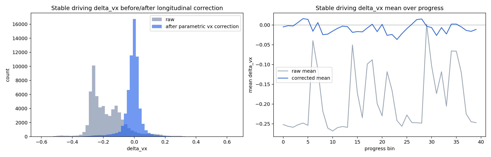

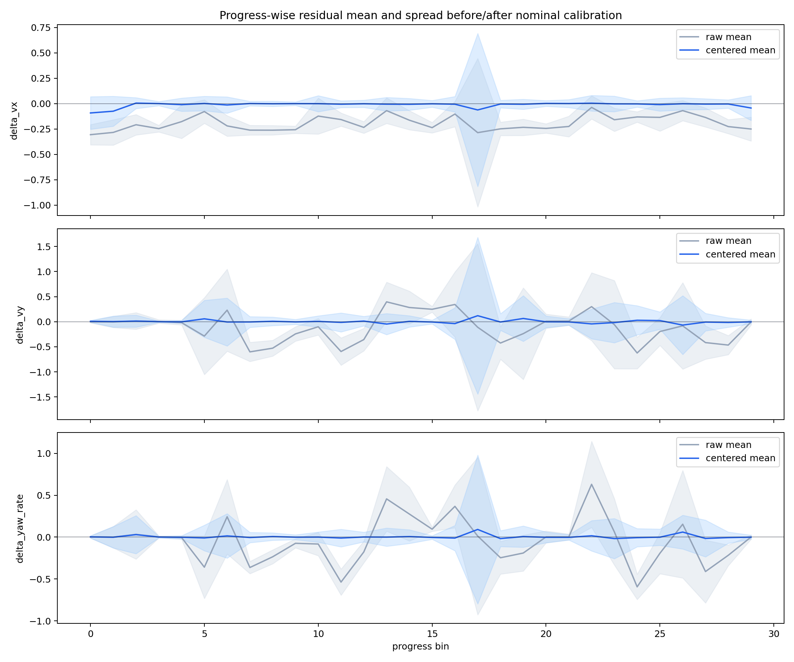

### 6.2 Richer telemetry context

The Barcelona run now explicitly carries drive-train and slip context into the feature vector.

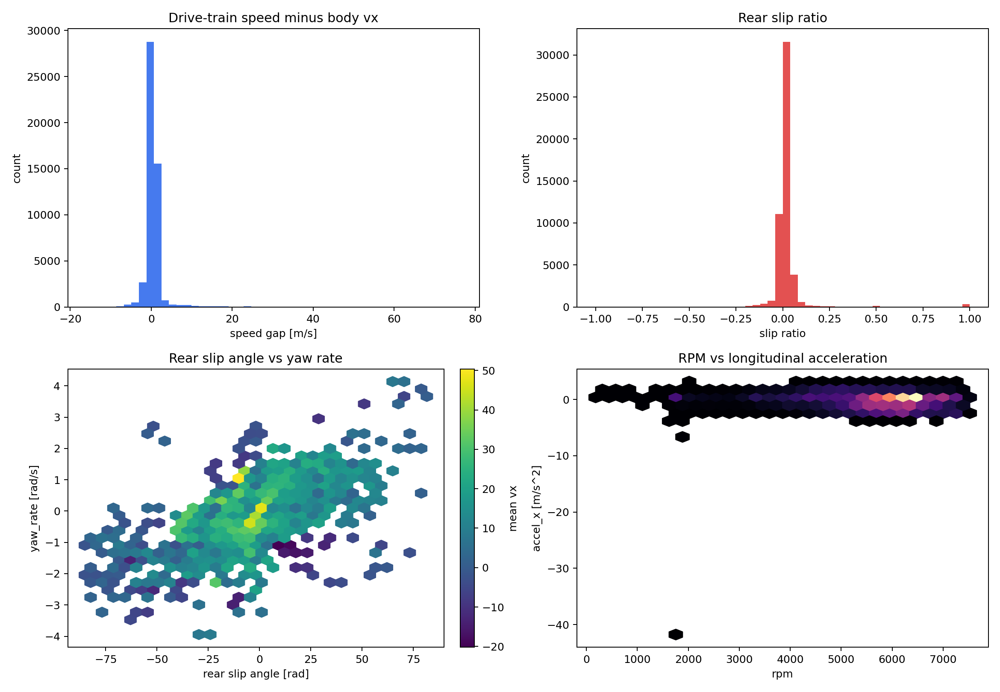

### 6.3 Stochastic residual quality

After deterministic centering, Barcelona keeps all three stochastic channels active:

- `delta_vx`: on
- `delta_vy`: on
- `delta_yaw_rate`: on

Held-out Wasserstein improves to:

- `delta_vx`: `0.0400 -> 0.0158`
- `delta_vy`: `0.1087 -> 0.0518`
- `delta_yaw_rate`: `0.0734 -> 0.0284`

Active regime counts:

- `delta_vx`: `37`
- `delta_vy`: `38`
- `delta_yaw_rate`: `38`

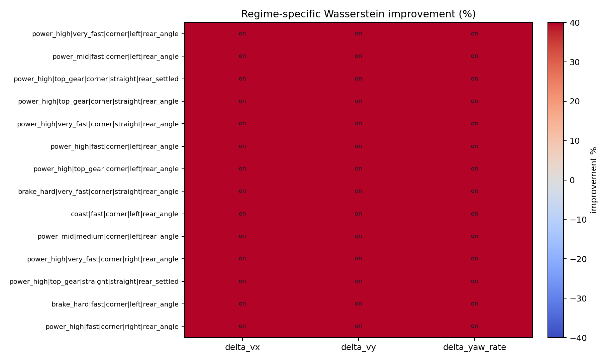

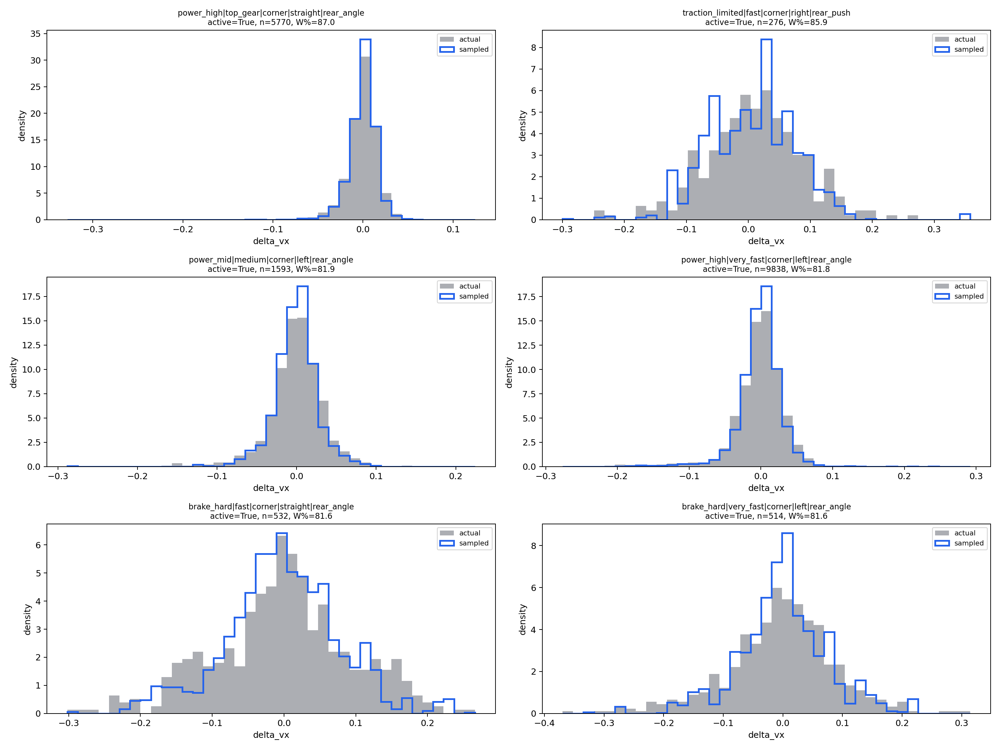

### 6.4 Multi-peak structure

Barcelona still contains strong multi-peak empirical slices after conditioning.

Examples found automatically in the latest run include:

- `delta_vx` slices with up to `7` peaks,
- `delta_vy` slices with up to `7` peaks,
- `delta_yaw_rate` slices with up to `5` peaks.

## 7. Latest Monza results

Monza is the cross-track validation run for the richer telemetry phase.

### 7.1 Deterministic calibration

Current Monza deterministic calibration:

- `delta_vx` all-data RMSE: `0.234 -> 0.063`
- `delta_vx` stable-driving RMSE: `0.235 -> 0.053`

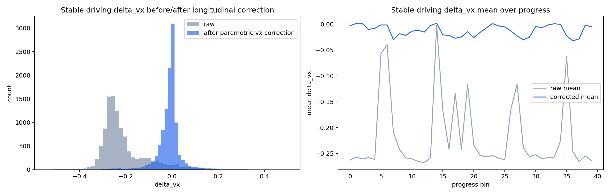

### 7.2 Richer telemetry context

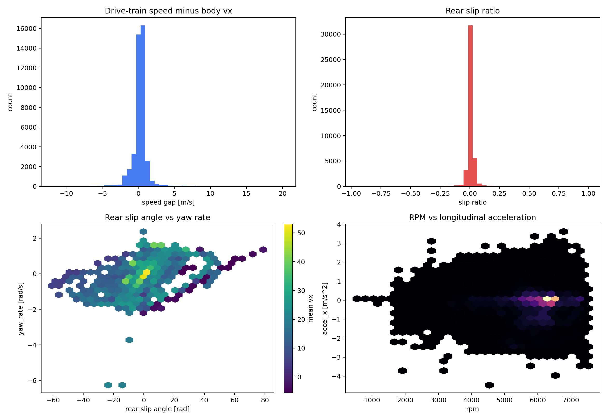

### 7.3 Stochastic residual quality

Monza also keeps all three stochastic channels active.

Held-out Wasserstein improves to:

- `delta_vx`: `0.0330 -> 0.0152`
- `delta_vy`: `0.1073 -> 0.0690`
- `delta_yaw_rate`: `0.0661 -> 0.0310`

Active regime counts:

- `delta_vx`: `9`
- `delta_vy`: `9`
- `delta_yaw_rate`: `9`

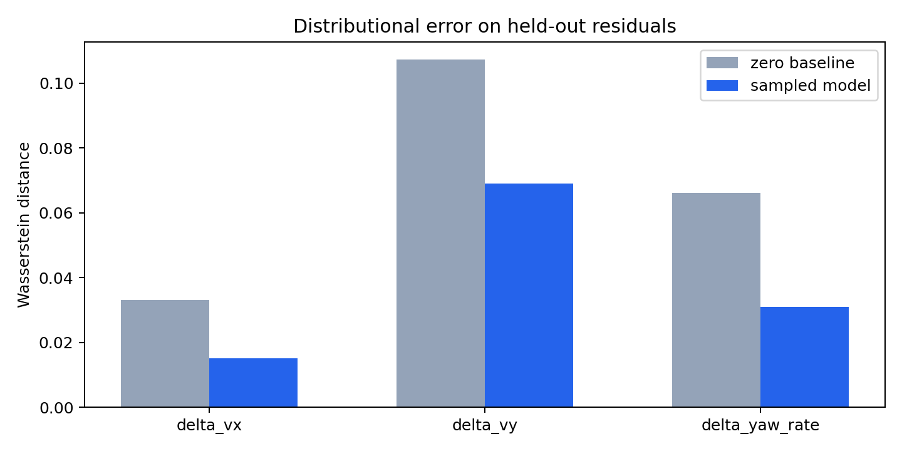

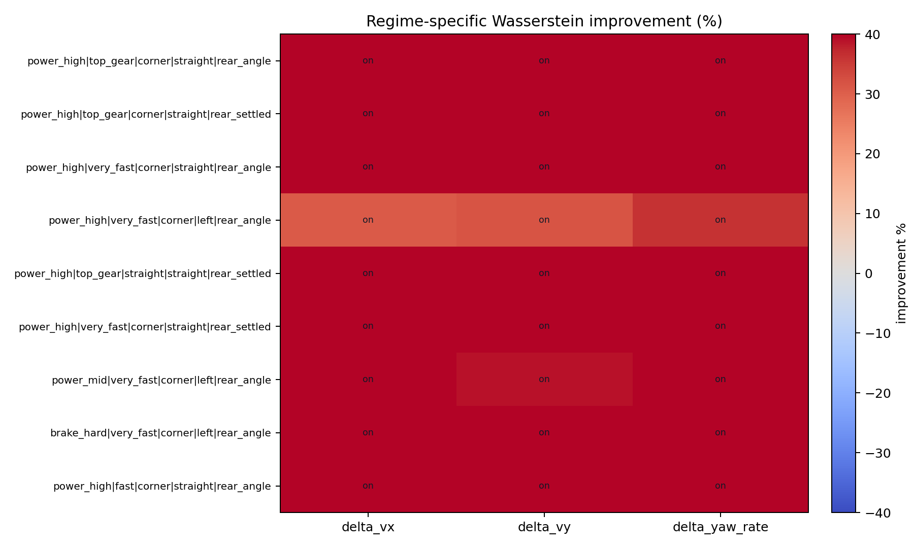

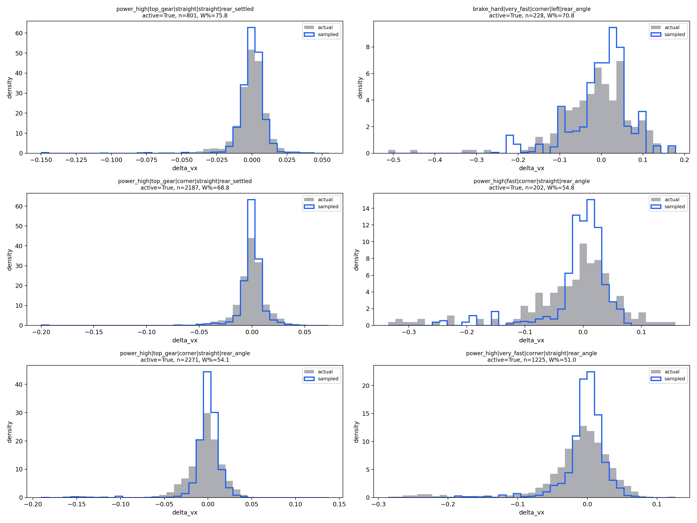

### 7.4 Multi-peak structure

Monza also shows strong multi-peak slices after conditioning:

- `delta_vx` slices with up to `6` peaks,
- `delta_vy` slices with up to `8` peaks,
- `delta_yaw_rate` slices with up to `6` peaks.

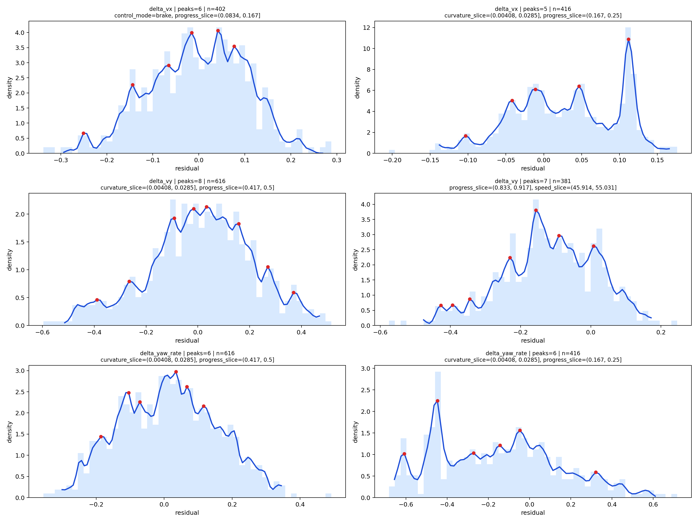

## 8. How the residual is injected online

At runtime, the rollout update is:

1. predict the next dynamic state with the nominal bicycle model,
2. add the deterministic calibration correction,
3. if empirical mode is enabled, sample a stochastic residual on top,
4. integrate pose with the corrected dynamic state.

So the uncertainty is:

- state dependent,
- action dependent,
- telemetry conditioned,
- weakly history dependent,
- temporally correlated over short blocks,
- mode-consistent over a rollout,
- regime conditioned in which channels are allowed to fire.

Training-facing uncertainty modes are now:

- `None` or `"nominal"`: pure nominal dynamic-bicycle rollout
- `"gaussian"`: fixed zero-mean Gaussian noise on `[delta_vx, delta_vy, delta_yaw_rate, delta_steer]`
- `"empirical"`: learned empirical residual sampling

The Gym API stays standard: use the constructor, `reset(options=...)`, or `env.set_uncertainty(...)`, while `step(action)` remains unchanged for RL libraries.

## 9. Closed-loop comparison and replay evaluation

### 9.1 Closed-loop nominal vs empirical divergence

The latest telemetry-conditioned ghost-comparison runs now diverge much more clearly.

Barcelona profiled run:

- about `0.10 m` separation by step `25`
- about `2.23 m` separation by step `50`
- about `5.95 m` separation by step `100`
- max about `12.43 m`

Monza profiled run:

- about `0.16 m` separation by step `25`
- about `0.37 m` separation by step `50`
- about `1.28 m` separation by step `100`
- max about `9.19 m`

In these comparison videos:

- dark blue solid car = empirical / noise-injected rollout
- light blue translucent car = calibrated nominal ghost

### 9.2 Fixed-action replay against real data

The repo now also has a replay-based evaluation mode in [uncertain_racecar_gym/replay_eval.py](uncertain_racecar_gym/replay_eval.py).

This replays the recorded Assetto action sequence and compares:

- actual recorded trajectory,
- nominal rollout,
- calibrated nominal rollout,
- empirical rollout.

Barcelona replay evaluation:

- nominal mean position RMSE: about `0.027 m`
- calibrated mean position RMSE: about `0.021 m`
- empirical mean position RMSE: about `0.021 m`

Monza replay evaluation:

- nominal mean position RMSE: about `0.014 m`
- calibrated mean position RMSE: about `0.015 m`
- empirical mean position RMSE: about `0.015 m`

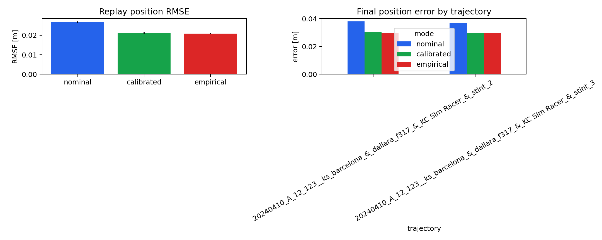

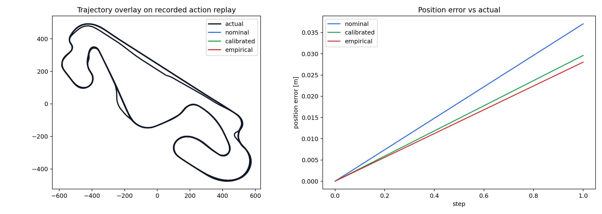

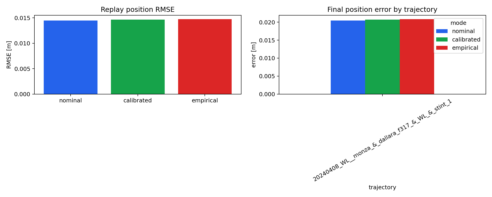

Interpretation:

- under recorded actions, the simulator can track held-out real laps closely in position,
- but the dynamic-channel errors are still nontrivial,
- and in closed-loop controller rollouts the hidden uncertainty can still accumulate into visibly different trajectories.

So replay accuracy and closed-loop divergence are both useful, but they answer different questions.

## 10. Current renderer status

The Tier 1 renderer is still a debug/demo renderer, not the publication renderer.

It is better than before:

- the road surface is now a continuous ribbon mesh,
- edge stripes and guardrail bands are continuous,
- the comparison videos are much easier to read.

But it is still not the final publication renderer.

The publication path remains:

1. simulate fast in Gymnasium,
2. export replay,
3. render offline in Blender or another higher-fidelity stack.

## 11. Honest limitations

The current strongest technical limitation is still model fidelity, not basic plumbing.

More specifically:

- replay position accuracy is already fairly good on the selected held-out trajectories,
- but lateral and yaw channel errors remain noticeable in replay diagnostics,
- the closed-loop divergence strength is still track and controller dependent,
- the Tier 1 renderer is still functional rather than publication-grade.

Another honest point:

- the stochastic model is continuous-state-conditioned and clearly non-Gaussian,
- but it is still a one-step discrete residual sampler, not a continuous-time latent stochastic process model.

## 12. Most important takeaway

The repo now has a real empirical uncertainty pipeline with:

- real offline racing data,
- richer telemetry-conditioned feature vectors,
- hybrid deterministic calibration,
- corrected unique trajectory IDs for lap ingestion,
- regime-aware stochastic channel masking,
- multi-peak non-Gaussian residuals on both Barcelona and Monza,
- cross-track validation,
- fixed-action replay evaluation against real data,
- stronger closed-loop nominal-vs-empirical divergence videos.

That means it is now much closer to the intended use case:

- a Gymnasium API,
- realistic uncertainty insertion,
- and a baseline simulator that can support meaningful nominal-vs-uncertainty-aware controller studies next.
